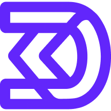

# DriftlessAF logo

## Square monochrome

<table>
  <tr>
    <th>Black</th>
    <th>Blurple</th>
    <th>White</th>
  </tr>
  <tr>
    <td></td>
    <td></td>
    <td></td>
  </tr>
  <tr>
    <td><a href="./black/driftlessaf-b-32.png">32px</a> · <a href="./black/driftlessaf-b-216.png">216px</a> · <a href="./black/driftlessaf-b-512.png">512px</a> · <a href="./black/driftlessaf-b-1080.png">1080px</a></td>
    <td><a href="./blurple/driftlessaf-bl-32.png">32px</a> · <a href="./blurple/driftlessaf-bl-216.png">216px</a> · <a href="./blurple/driftlessaf-bl-512.png">512px</a> · <a href="./blurple/driftlessaf-bl-1080.png">1080px</a></td>
    <td><a href="./white/driftlessaf-w-32.png">32px</a> · <a href="./white/driftlessaf-w-216.png">216px</a> · <a href="./white/driftlessaf-w-512.png">512px</a> · <a href="./white/driftlessaf-w-1080.png">1080px</a></td>
  </tr>
</table>

## Square, decorative

For black background, 1465px:&nbsp;&nbsp;&nbsp;

 

For white background, 1465px:&nbsp;&nbsp;&nbsp;

 

## Horizontal with name

Black, 2305px w, 500px h:&nbsp;&nbsp;&nbsp;

 

Blurple, 2305px w, 500px h:&nbsp;&nbsp;&nbsp;

 

White, 2305px w, 500px h:&nbsp;&nbsp;&nbsp;

 
